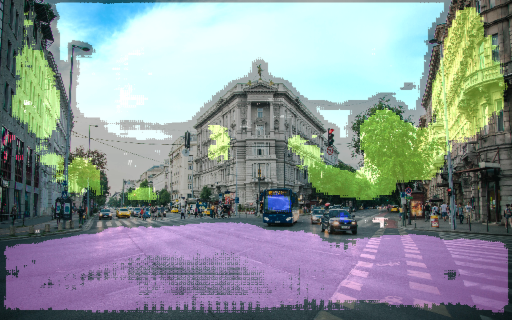
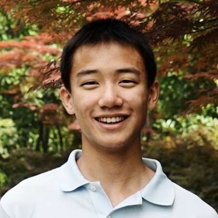

## Introduction

We wanted to build a self driving car. We didn't build an actual car, but we built a golf cart, and wrote a system that can work on a real car as well. 

This project has several different modules. 

1. Autonomous steering 
2. Autonomous cruise contol system
3. System management
3. Path planning
4. Engineering

## Steering
The software behind the steering system is largly inspired by work done by [Nvidia](https://arxiv.org/pdf/1604.07316.pdf). The hardware system is custom designed in house. Here is a video demo.

## Autonomous Cruise Control System (ACCS)
### Semantic Segmentation

Understanding the work around the vehicle through segmentation, and making decisions based on the segmentic segmentation results

## Path Planning

Coming soon...

## Contact / Info
If you are interested in the detailed development process of this project, you can visit Neil's blog at [neilnie.com](neilnie.com) to find out more about it. Neil will make sure to keep you posted about all of the latest development on the club. 

**Developers:**

**Michael Meng** | [Email](mailto:xmeng18@deerfield.edu) | [Github](https://github.com/xmeng17)

**Neil (Yongyang) Nie** | [Email](mailto:yongyang.nie@gmail.com) | [Github](https://www.github.com/NeilNie) | [Website](neilnie.com) | [Linkedin](https://www.linkedin.com/in/yongyang-neil-nie-896204118/)
