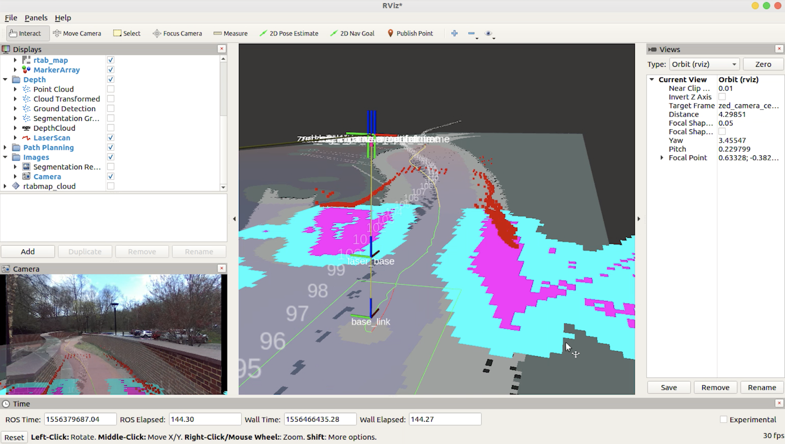

    

⚠️ This repo is no longer being maintained. Feel free to use the source or send me any questions, unfortunately no new commits or PRs will be added/accepted ⚠️

Welcome! This is an open source self-driving development platform aimed for rapid prototyping, deep learning, and robotics research. The system currently runs on a modified electric golf cart. Here are our goals:

### Goals:
Research and develop a deep learning-driven self-driving car. The vehicle should be able to achieve level 4 autonomy within a geofenced area.

#### The modules in this project.

1. End-to-End Steering (Behavioral cloning)
2. Semantic Segmentation
3. Object Detection 🚙
4. Drive by Wire (DBW)
5. CARLA simulator integration 
6. ZED stereoscopic vision system
7. Mapping with rtabamp
8. Path planning with ROS nav stack. 
9. Localization, pose tracking, and odom with ZED and rtabmap.

For the full documentation of the development process, please visit my website: [www.neilnie.com](https://www.neilnie.com)

## Table of Content
- [Try it out](#Try%20it%20out)
- [About ROS](./ros/README.md)
- [Simulation](#Simulation)
- [Autopilot & End-to-End Behavioral Cloning](./ros/src/autopilot/README.md)
- [Semantic Segmentation](./ros/src/segmentation/README.md)
- [The Navigation Stack](./ros/src/navigation/README.md)

## Try it out
Before you jump in, let me describe the hardware requirement for this project. **A webcam is the minimum requirment.** At this point, you can only run the whole system on the actual self-driving vehicle. ROS will throw warnings (even errors) at you if you don't have the hardware connected to your Linux machine. **If you don't have access to the hardware setup, don't worry** 👇
 
- The best way is to download and play back the ROS bags. [coming soon...]
- You can tryout individual packages and nodes, and might find them helpful for your own projects. 
- You can also tryout the CARLA simulator. (Maybe even improve the current system.)

To compile the project:

##### Requirements

1. Make sure that you have [ROS](http://wiki.ros.org/melodic/Installation/Ubuntu) installed on your computer. (I am using ROS Melodic)
2. Make sure you have all the [dependencies](./ros/requirements.txt) installed. 

##### Clone & Compile

1. Clone the repository. `$ git clone https://github.com/sigmaai/self-driving-golf-cart.git`
2. `$ cd self-driving-golf-cart/ros` 
3. `$ catkin_make`
4. `$ source devel/setup.bash`

##### Launch ZED cameras
- `$ roslaunch zed_wrapper zed.launch` (no rviz)
- `$ roslaunch zed_display display.launch` (with rviz)

##### Launch the Navigation Stack
- `$ roslaunch path_planning rtab_mapping_navigation.launch` 

	

🚙 Bon Voyage 😀

# Contact / Info
If you are interested in the detailed development process of this project, you can visit Neil's blog at [neilnie.com](https://neilnie.com) to find out more about it. Neil will make sure to keep you posted about all of the latest development on the club.

**Developers:**

**Neil (Yongyang) Nie** | [Email](mailto:yongyang.nie@gmail.com) | [Github](https://www.github.com/NeilNie) | [Website](neilnie.com) | [Linkedin](https://www.linkedin.com/in/yongyang-neil-nie-896204118/)

**Michael Meng** | [Email](mailto:xmeng18@deerfield.edu) | [Github](https://github.com/xmeng17)