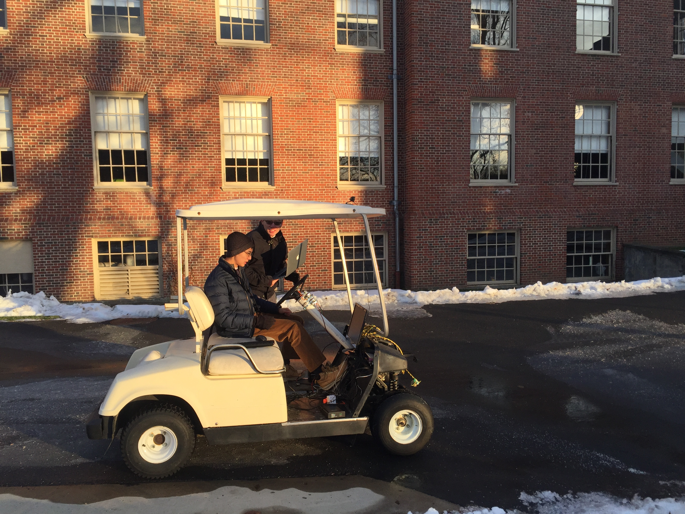

# ALVNS
Autonomous Land Vehicle Navigation System. Neil Nie & Michael Meng, 2017 

## Introduction
We wanted to build a self driving car. We didn't build an actual car, but we built a golf cart, and wrote a system that can work on a real car as well. 

This project has several different modules. 

1. Autonomous steering 
2. Road segmentation 🛣️ 🚗
3. Path planning
4. Engineering

## Steering
The software behind the steering system is largly inspired by work done by [Nvidia](https://arxiv.org/pdf/1604.07316.pdf). The hardware system is custom designed in house. Here is a video demo.

video

## Cruise

## Semantic Segmentation

Understanding the work around the vehicle through segmentation, and making decisions based on the segmentic segmentation results

## Path Planning