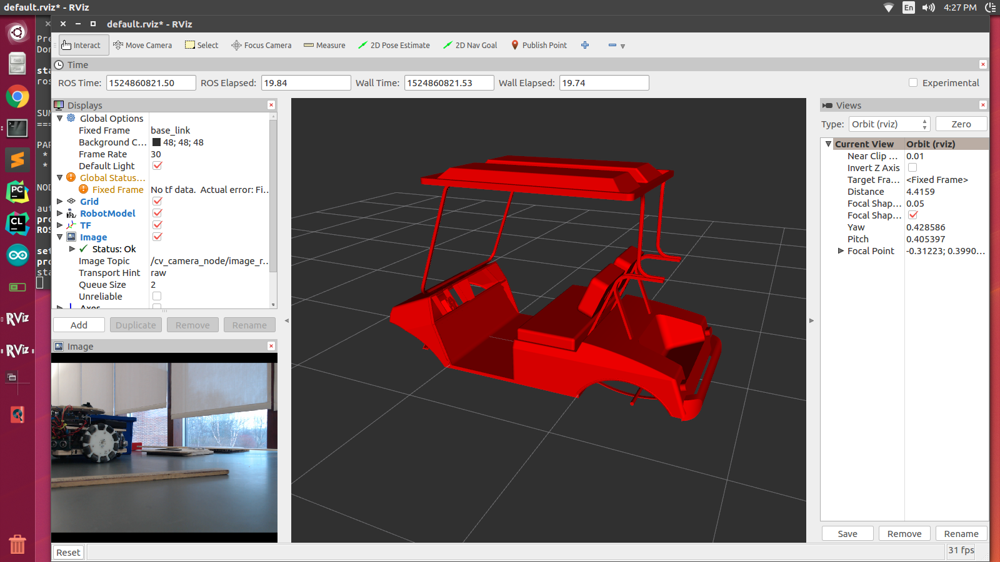

## Introduction

We wanted to build a self driving car. We didn't build an actual car, but we built a golf cart, and wrote a system that can work on a real car as well. 

Here are the modules in this project.

1. Behavioral cloning
2. Semantic segmentation
3. Driver by wire system (DBW) 
4. Object detection 🚙
5. Traffic light detection 🚦
6. Lane Detection 🛣
7. Path planning

Localization and some other features coming soon...

## Running the code
1. Please download/clone the repository.
2. Make sure you have all the [dependencies](./requirements.txt) installed. 
3. Make sure that you have the [ROS](http://wiki.ros.org/ROS/Installation) installed on your computer.
4. `cd YOUR_PROJECT_DIRECTORY`
5. `catkin_make`
6. `source devel/setup.bash`
7. `roscore`
8. `roslaunch driver drive.launch`

Bon Voyage 😀

## Steering
The algorithm behind the steering system is inspired by work done by [Nvidia](https://arxiv.org/pdf/1604.07316.pdf). We developed our own convolutional neural network to predict the steering angle based on images captured by the front camera. The hardware system is custom designed in-house. Here is a video demo.

## Autonomous Cruise Control System (ACCS)
### Semantic Segmentation

The cart understands the world around through segmentation. It also makes decisions based on the segmentic segmentation results. The vehicle can change its speed based on the proximity to nearby obstacles. 

## Path Planning

Coming soon...

## Localization

Coming soon...

## Development process
We have completed phase 1 of the development process, which mainly includes:

- Implementing control-by-wire system. (hardware)
- Implement the autonomous steering system.
- Implement the obstacle avoidance system. 

For the second phase of the development process, we will focus on making the system safer and more reliable. For details, please refer to the [CHECKLIST](./CHECKLIST.md)

## Contact / Info
If you are interested in the detailed development process of this project, you can visit Neil's blog at [neilnie.com](neilnie.com) to find out more about it. Neil will make sure to keep you posted about all of the latest development on the club. 

**Developers:**

**Neil (Yongyang) Nie** | [Email](mailto:yongyang.nie@gmail.com) | [Github](https://www.github.com/NeilNie) | [Website](neilnie.com) | [Linkedin](https://www.linkedin.com/in/yongyang-neil-nie-896204118/)

**Michael Meng** | [Email](mailto:xmeng18@deerfield.edu) | [Github](https://github.com/xmeng17)