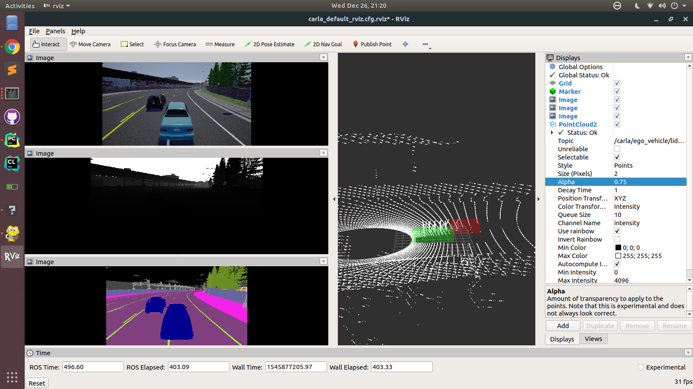
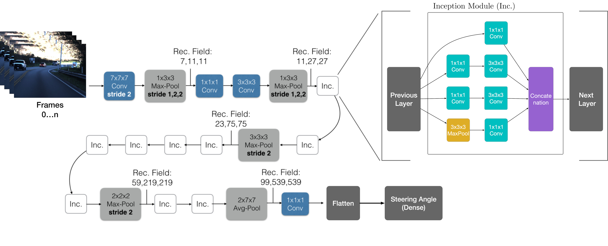
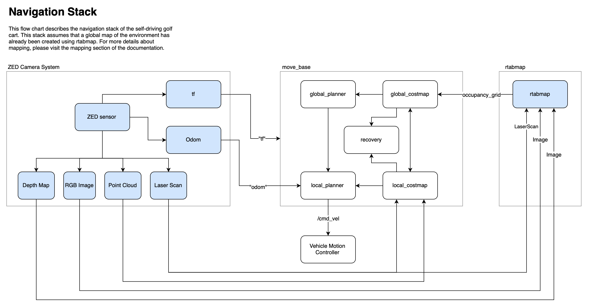
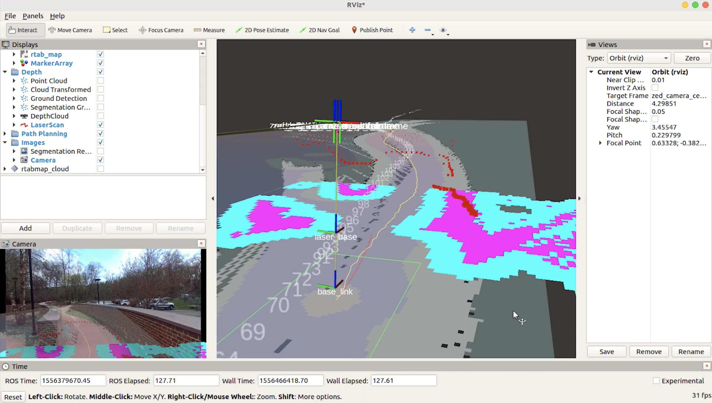

    

Welcome! This is an open source self-driving development platform aimed for rapid prototyping, deep learning, and robotics research. The system currently runs on a modified electric golf cart. Here are our goals:

### Goals:
Research and develop a deep learning-driven self-driving car. The vehicle should be able to achieve level 4 autonomy within a geofenced area.

#### The modules in this project.

1. End-to-End Steering (Behavioral cloning)
2. Semantic Segmentation
3. Object Detection 🚙
4. Drive by Wire (DBW)
5. CARLA simulator integration 
6. ZED stereoscopic vision system
7. Mapping with rtabamp
8. Path planning with ROS nav stack. 
9. Localization, pose tracking, and odom with ZED and rtabmap.

For the full documentation of the development process, please visit my website: [www.neilnie.com](https://www.neilnie.com)

## Table of Content
- [Try it out](#Try%20it%20out)
- [About ROS](#About%20ROS)
- [Simulation](#Simulation)
- [Autopilot & End-to-End Behavioral Cloning](#Autopilot%20&%20End-to-End%20Behavioral%20Cloning)
	* [What's Behavioral Cloning](#What's%20Behavioral%20Cloning)
	* [Model](#Model)
- [Semantic Segmentation](#Semantic%20Segmentation)
- [The Navigation Stack](#The%20Navigation%20Stack)
	* [RTABMap](#RTABMap)
	* [Path Planning](#Path%20Planning)
	* [Vehicle Motion Control](#Vehicle%20Motion%20Control)

## Try it out
Before you jump in, let me describe the hardware requirement for this project. **A webcam is the minimum requirment.** At this point, you can only run the whole system on the actual self-driving vehicle. ROS will throw warnings (even errors) at you if you don't have the hardware connected to your Linux machine. **If you don't have access to the hardware setup, don't worry** 👇
 
- The best way is to download and play back the ROS bags. [coming soon...]
- You can tryout individual packages and nodes, and might find them helpful for your own projects. 
- You can also tryout the CARLA simulator. (Maybe even improve the current system.)

To compile the project:

##### Requirements

1. Make sure that you have [ROS](http://wiki.ros.org/melodic/Installation/Ubuntu) installed on your computer. (I am using ROS Melodic)
2. Make sure you have all the [dependencies](./ros/requirements.txt) installed. 

##### Clone & Compile

1. Clone the repository. `$ git clone https://github.com/sigmaai/self-driving-golf-cart.git`
2. `$ cd self-driving-golf-cart/ros` 
3. `$ catkin_make`
4. `$ source devel/setup.bash`

##### Launch ZED cameras
- `$ roslaunch zed_wrapper zed.launch` (no rviz)
- `$ roslaunch zed_display display.launch` (with rviz)

##### Launch the Navigation Stack
- `$ roslaunch path_planning rtab_mapping_navigation.launch` 

	

🚙 Bon Voyage 😀

## About ROS
This project uses ROS. __For more information on ROS, nodes, topics and others please refer to the ROS [README](./ros/README.md).__

## Simulation
(🏗 Construction Zone 🚧)

Building a self-driving car is hard. Not everyone has access to expensive hardware. I am currently trying to integrate this project with the CARLA self-driving simulator. If you are interested in CARLA, please refer to this [documentation](./ros/src/simulation/README.md). The ROS system in this project can *partially* run on the CARLA simulator. 

__If you want to try out the simulator, please refer to the documentation [here](./ros/src/simulation/README.md).__

    

## Autopilot & End-to-End Behavioral Cloning

The autopilot system, found here in the [autopilot node](./ros/src/autopilot), uses deep learning to predict the steering commands and acceleration commands for the vehicle, only using data collected by the front facing camera. 

### What's Behavioral Cloning
In 2016, NVIDIA proposed a novel deep learning approach allowed their car to accurately perform real-time end-to-end steering command prediction. Around the same time, Udacity held a challenge that asked researchers to create the best end-to-end steering prediction model. Our goal is to further the work in behavioral cloning for self-driving vehicles. 

### Model

NVIDIA's paper used a convolutional neural network with a single frame input. I believe that the single-frame-input CNN doesn't provide any temporal information which is critical in self-driving. This is the motive behind choosing the i3d architecture, which is rich in spacial-temporal information.

The input of the network is a 3d convolutional block, with the shape of `n * weight * height * 3`. `n` is the length of the input sequence. A flatten layer and a dense layer are added to the back of the network for the purpose of this regression problem. 

	

Here is a video demo of deep learning model running on the autonomous golf cart. 

[VIDEO DEMO](https://www.youtube.com/watch?v=4bZ40W4BGoE)

## Semantic Segmentation
The cart understands its surrounding  through semantic segmentation, which is a technique in computer that classifies each pixel in an image into different categories. The vehicle can also make decisions based on the segmentic segmentation results. The cart can change its speed based on the proximity to nearby obstacles.

We deployed the ENet architecture for segmentation. ENet is design to work well in realtime applications. For more information, please visit the [paper](http://arxiv.org/pdf/1606.02147.pdf). We used the CityScape dataset for training and the python code for training and inferencing are located in the `./src/segmentation/scripts` directory.

[VIDEO DEMO](https://www.youtube.com/watch?v=_y2RCakRrc4)

## The Navigation Stack

	

The self-driving vehicle uses a modified version of the ROS navigation stack. The flowchart above illustrate the mapping and path planning process. First, I create a detailed map of the environment with `rtabmap_ros`. With that global map, I use the localization feature of `rtabmap_ros` and the odom feature of the zed camera system to localize and plan paths. 

### RTABMap

`rtabmap` (realtime appearance based mapping) allows me to construct a global map of the environment. For more information on the mapping package, please check out this [`.launch` file](./ros/src/navigation/mapping/launch/rtab_mapping.launch). 

	

 

### Path Planning

The project uses the [`move_base`](http://wiki.ros.org/move_base) node from the navigation stack. The image below shows the costmap (in blue and purple), and the global occupancy grid (in black and gray). `move_base` also plans the local and global path. Global paths are shown in green and yellow below. You can find the `yaml` files [here](./ros/src/navigation/path_planning/params). 

	

### Vehicle Motion Control

The move base node publishes `/cmd_vel` commands, which are processed and sent directly to the vehicle. 

# Contact / Info
If you are interested in the detailed development process of this project, you can visit Neil's blog at [neilnie.com](https://neilnie.com) to find out more about it. Neil will make sure to keep you posted about all of the latest development on the club.

**Developers:**

**Neil (Yongyang) Nie** | [Email](mailto:yongyang.nie@gmail.com) | [Github](https://www.github.com/NeilNie) | [Website](neilnie.com) | [Linkedin](https://www.linkedin.com/in/yongyang-neil-nie-896204118/)

**Michael Meng** | [Email](mailto:xmeng18@deerfield.edu) | [Github](https://github.com/xmeng17)