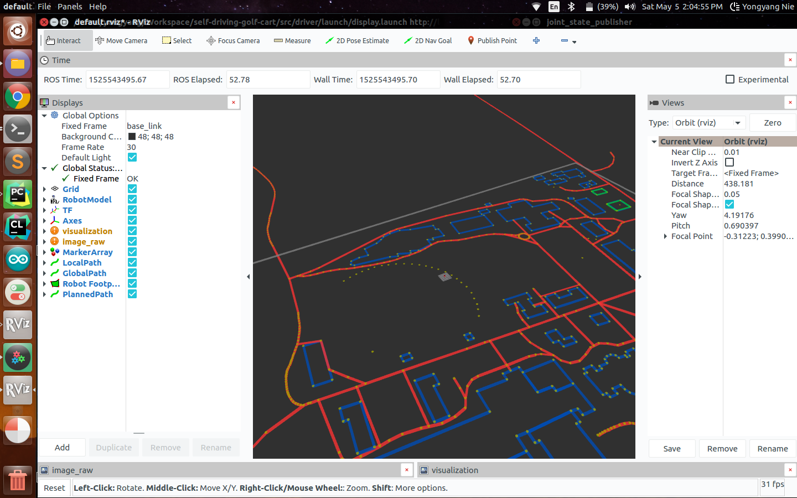

    

# Introduction

Welcome! This is an open source self-driving development platform aimed for rapid prototyping, deep learning and robotics research. The system currently runs on a modified electric golf cart, but the code could work on a real car as well. Here are our goals:

### Goals:
Research and develop a deep learning-driven self-driving car. The vehicle should be able to navigate autonomously between locations within a geofenced area.

#### The modules in this project.

1. End-to-End Steering (Behavioral cloning)
2. Semantic Segmentation
3. Object Detection 🚙
4. Drive by Wire (DBW)
5. Localization 🛰️ (currently with GPS)
6. CARLA simulator integration 

Stereoscopic vision system coming soon...

For the full documentation of the development process, please visit my website: [www.neilnie.com](https://www.neilnie.com)

# Try it out
Before you jump in, let me describe the hardware requirement for this project. **A webcam is the minimum requirment.** At this point, you can only run the whole system on the actual self-driving vehicle. ROS will throw warnings (even errors) at you if you don't have the hardware connected to your Linux machine. **If you don't have access to the hardware setup, don't worry** 👇
 
- You can tryout individual packages and nodes, and might find them helpful for your own projects. 
- You can also tryout the CARLA simulator. (Maybe even improve the current system.)

To compile the project:

1. Clone the repository.
2. Make sure you have all the [dependencies](./ros/requirements.txt) installed. 
3. Make sure that you have [ROS](http://wiki.ros.org/melodic/Installation/Ubuntu) installed on your computer. (I am using ROS Melodic)
4. `cd PROJECT_DIRECTORY/ros` 
5. `catkin_make`
6. `source devel/setup.bash`
7. `roslaunch driver drive.launch`

You should see this screen pop up. 

	

🚙 Bon Voyage 😀

# ROS
This project uses ROS. The launch files will launch the neccesary nodes as well as rviz for visualization. __For more information on ROS, nodes, topics and others please refer to the ROS [README](./ros/README.md).__

# Simulation
(🏗 Construction Zone 🚧)

Building a self-driving car is hard. Not everyone has access to expensive hardware. I am currently trying to integrate this project with the CARLA self-driving simulator. If you are interested in CARLA, please refer to this [documentation](./ros/src/simulation/README.md). The ROS system in this project can *partially* run on the CARLA simulator. 

__If you want to try out the simulator, please refer to the documentation [here](./ros/src/simulation/README.md).__

    

# The Autopilot System

TAS, found here in the [autopilot node](./ros/src/autopilot), uses deep learning to predict the steering commands and acceleration commands for the vehicle, only using data collected by the front facing camera. 
### End-to-End Behavioral Cloning
Several years ago, NVIDIA proposed a novel deep learning approach allowed their car to accurately perform real-time end-to-end steering command prediction. Around the same time, Udacity held a challenge that asked researchers to create the best end-to-end steering prediction model. This component is inspired by the competition, and the goal is to further the work in behavioral cloning for self-driving vehicles. 

NVIDIA's paper used a convolutional neural network with a single frame input. I believe that the single-frame-input CNN doesn't provide any temporal information which is critical in self-driving. This is the motive behind choosing the i3d architecture, which is rich in spacial-temporal information.

### Model
The input of the network is a 3d convolutional block, with the shape of `n * weight * height * 3`. `n` is the length of the input sequence. Furthermore, the network also uses nine inception modules. The output layers are modified to accommodate for this regression problem. A flatten layer and a dense layer are added to the back of the network. 

	

Here is a video demo of deep learning model running on the autonomous golf cart. 

[VIDEO DEMO](https://www.youtube.com/watch?v=4bZ40W4BGoE)

## Semantic Segmentation
The cart understands its surrounding  through semantic segmentation, which is a technique in computer that classifies each pixel in an image into different categories. The vehicle can also make decisions based on the segmentic segmentation results. The cart can change its speed based on the proximity to nearby obstacles.

We deployed the ENet architecture for segmentation. ENet is design to work well in realtime applications. For more information, please visit the [paper](http://arxiv.org/pdf/1606.02147.pdf). We used the CityScape dataset for training and the python code for training and inferencing are located in the `./src/segmentation/scripts` directory.

[VIDEO DEMO](https://www.youtube.com/watch?v=_y2RCakRrc4)

# Localization

Currently, the localization module uses GPS (Global Positioning System) to find the precise location of the vehicle. However, GPS is far from enough. Localization using lidar and radar (sensor fusion and particle filters) are currently under development.

	

Furthermore, we are relying on OSM (Open Street Map) data for navigation. OSM maps provide detailed information about the paths, buildings and other landmarks in the surrounding. Currently, navigation is only limited to a geofenced area.

	

# Path Planning

Coming soon...

# What's next?

#### Phase 1

We have completed phase 1 of the development process, which mainly includes:

- Drive-by-wire system.
- Autonomous steering system with deep learning
- Basic obstacle avoidance system using segmentation & detection

As you might have realized, all of these above are focused on computer vision and deep learning. Currently, the vehicle can navigate autonomously in a controlled outdoor environment for about 1000 feet, swiftly avoiding obstacles and stopping for pedistrians.

#### Phase 2

For the second phase of the development process, we will focus on making the system safer and more reliable. Basic plans include:

- Implement a localization system.
- Write a path planner.
- Collect more data in our geofenced enviroment. ✅
- Improve the computer hardware. ✅
- Improve the sensor system.

We are keeping track of all our progress here [CHECKLIST](./CHECKLIST.md). 

# Contact / Info
If you are interested in the detailed development process of this project, you can visit Neil's blog at [neilnie.com](https://neilnie.com) to find out more about it. Neil will make sure to keep you posted about all of the latest development on the club.

**Developers:**

**Neil (Yongyang) Nie** | [Email](mailto:yongyang.nie@gmail.com) | [Github](https://www.github.com/NeilNie) | [Website](neilnie.com) | [Linkedin](https://www.linkedin.com/in/yongyang-neil-nie-896204118/)

**Michael Meng** | [Email](mailto:xmeng18@deerfield.edu) | [Github](https://github.com/xmeng17)