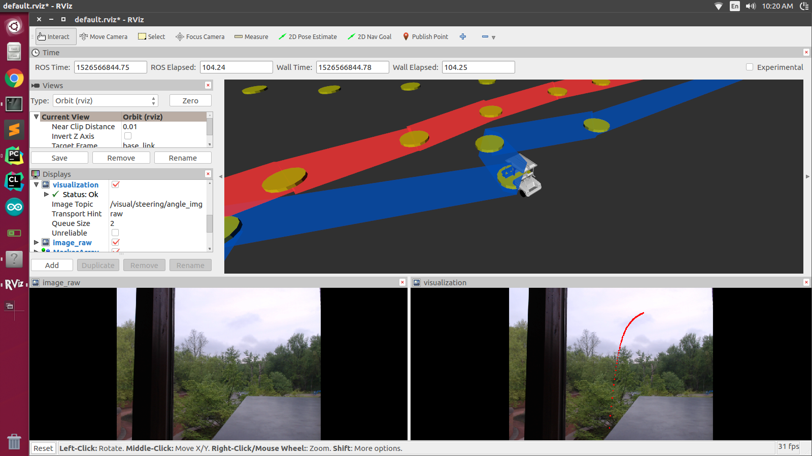
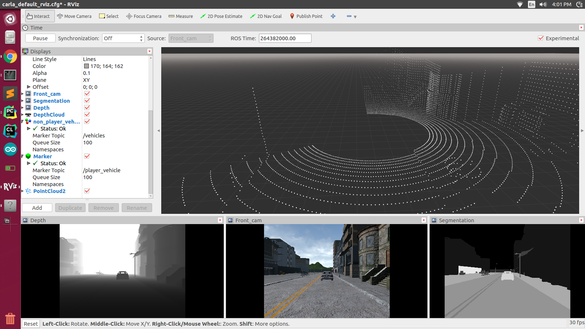
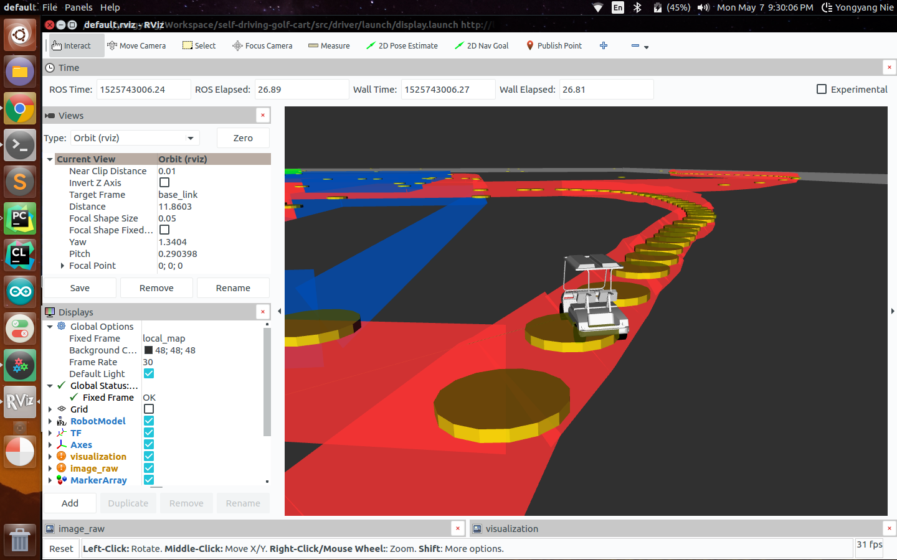

## Introduction

Welcome! This is an open source self-driving development platform aimed for rapid prototyping, deep learning and robotics research. The system currently runs on a modified electric golf cart, but the code could work on a real car as well. Here are our goals:

### Goals:
1. Research and develop a deep learning-driven self-driving car.
2. The vehicle should be able to navigate from point A to point B autonomously within a geofenced area.

#### Here are the modules in this project.

1. Autonomous steering (Behavioral cloning)
2. Semantic segmentation
3. Driver by wire system (DBW)
4. Object detection 🚙
5. Traffic light detection 🚦
6. Lane Detection 🛣
7. Localization 🛰️ (currently with GPS)

Path planning is coming soon...

For the full documentation of the development process, please visit: [neilnie.com](neilnie.com)

## Running the code
1. Please download/clone the repository.
2. Make sure you have all the [dependencies](./requirements.txt) installed. 
3. Make sure that you have the [ROS](http://wiki.ros.org/ROS/Installation) installed on your computer.
4. `cd YOUR_PROJECT_DIRECTORY`
5. `catkin_make`
6. `source devel/setup.bash`
7. `roscore`
8. `roslaunch driver drive.launch`

Bon Voyage 😀

## Simulation
If you want to run the code inside the Carla self-driving simulator, please refer to this [documentation](./src/simulation/README.md).

## ROS
This project is being developed using ROS. The launch files will launch the neccesary nodes as well as rviz for visualization. For more information on ROS, nodes, topics and others please refer to the [README](./src/README.md) in the `./src` directory.

## Steering
We deploy deep learning, specifically behavorial cloning for the steering steering system. This work was inspired by [Nvidia](https://arxiv.org/pdf/1604.07316.pdf). We developed our own convolutional neural network to predict the steering angle based on images captured by the front-facing camera. The hardware system steer-by-wire system is custom designed in-house. Here is a video demo.

## Autonomous Cruise Control System (ACCS)

#### Semantic Segmentation

The cart understands the surrounding  through semantic segmentation, which is a technique in computer that classifies each pixel in an image. The vehicle can also make decisions based on the segmentic segmentation results. The cart can change its speed based on the proximity to nearby obstacles.

We deployed the ENet architecture for segmentation. ENet is design to work well in realtime applications. For more information, please visit the [paper](http://arxiv.org/pdf/1606.02147.pdf). We used the CityScape dataset for training and the python code for training and inferencing are located in the `./src/segmentation/scripts` directory.

## Localization

Currently, the localization module uses GPS (Global Positioning System) to find the precise location of the vehicle. However, GPS is far from enough. Localization using lidar and radar (sensor fusion and particle filters) are currently under development.

Furthermore, we are relying on OSM (Open Street Map) data for navigation. OSM maps provide detailed information about the paths, buildings and other landmarks in the surrounding. Currently, navigation is only limited to a geofenced area.

## Path Planning

Coming soon...

## What's next?

#### Phase 1

We have completed phase 1 of the development process, which mainly includes:

- Drive-by-wire system.
- Autonomous steering system with deep learning
- Basic obstacle avoidance system using segmentation & detection

As you might have realized, all of these above are focused on computer vision and deep learning. Currently, the vehicle can navigate autonomously in a controlled outdoor environment for about 1000 feet, swiftly avoiding obstacles and stopping for pedistrians.

#### Phase 2

For the second phase of the development process, we will focus on making the system safer and more reliable. Basic plans include:

- Implement a localization system.
- Write a path planner.
- Collect more data in our geofenced enviroment. ✅
- Improve the computing system. ✅
- Improve the sensor system.

We are keeping track of all our progress here [CHECKLIST](./CHECKLIST.md). 

## Contact / Info
If you are interested in the detailed development process of this project, you can visit Neil's blog at [neilnie.com](neilnie.com) to find out more about it. Neil will make sure to keep you posted about all of the latest development on the club.

**Developers:**

**Neil (Yongyang) Nie** | [Email](mailto:yongyang.nie@gmail.com) | [Github](https://www.github.com/NeilNie) | [Website](neilnie.com) | [Linkedin](https://www.linkedin.com/in/yongyang-neil-nie-896204118/)

**Michael Meng** | [Email](mailto:xmeng18@deerfield.edu) | [Github](https://github.com/xmeng17)