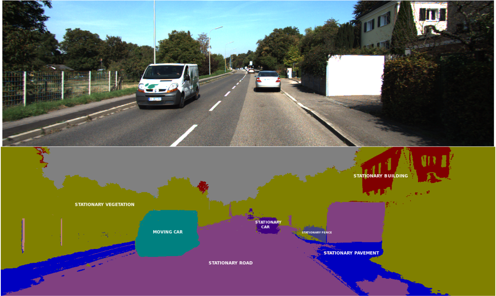

# Semantic Segmentation
We believe that there are three important components to this project. 

1. End-to-end steering with ConvNet
2. End-to-end cruise control with ConvNet
3. Understanding the surrouding with ConvNet

The last component is critical in making decisions under special/unexpected conditions. We need to detect the pedestrian
vehicles and other objects around us. We can accomplish this using detection/localization networks such as Yolo9000, however,
running tiny-yolo on the Jetson is painful. 

The solution to this problem is to use semantic segmentation. 

new-enet-5.h5: 512x512x26

enet-c-v1-2.h5: 640x320x16

enet-c-v2-1.h5 1024x512x16