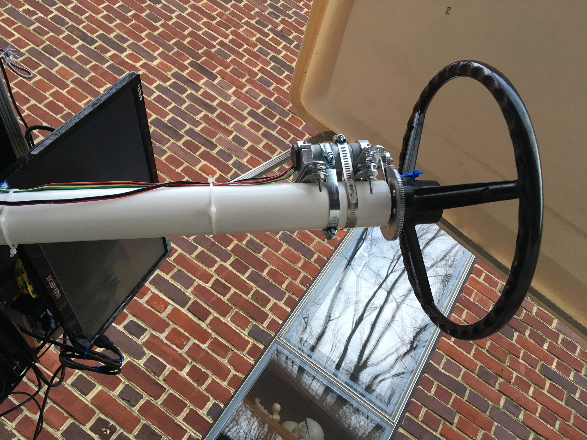
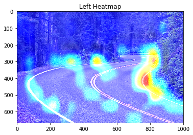

# Welcome to Autonomous Steering Control System (ASCS)
One of the most important aspect of the vehicle is the autonomous steering system.  

## About this directory
### Training
`train.py` trains the ConvNet

`models.py` has all the model architectures

### Running
`steering_predictor` is a class that `drive.py` calls. The predictor takes in an image and return a visualization and steering angle.

`mc.py` uses serial communication to send the arduino & motor controller commands.

`./motor_control` has the arduino motor control program.

### Visualization
I have implemented some methods for you to visualize the autonomous steering system. All of those scripts can be found in the `./visualization` directory. 

`testing_visualizer.py` allows you to visualize the trained results. You must have the [Udacity validation dataset](https://github.com/udacity/self-driving-car/blob/master/datasets/CH2/Ch2_001.tar.gz.torrent).

There is also a attention visualizatio script which the car uses to draw a heatmap overlay on the input image. You can use this to study the behavior of the model. 

## Others

`simulation.py` allows you to run a trained model on the Udacity driving simulator. You can download it here. 

`validation.py` run inferences on all images in the Udacity validation dataset. This is a performance benchmark for the models. 